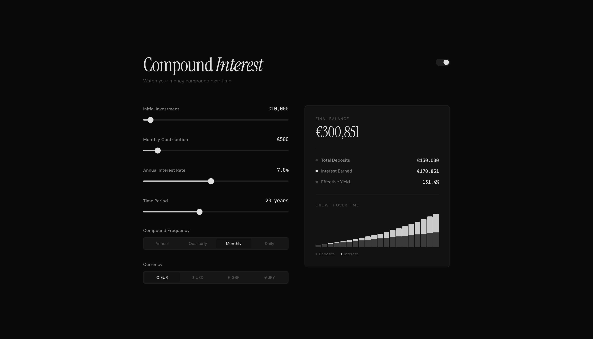

# Compound *Interest*

Your money is working. This shows you how hard.

**[Open the calculator](https://cozats.github.io/compound-interest/)**

---

A single-file compound interest calculator. No spreadsheet aesthetics. No form fields. Just sliders.

Drag. Watch the numbers move. See the gap between what you put in and what time gave you back.

### What's inside

Sliders for principal, contributions, rate, and timeline. Multi-currency (EUR, USD, GBP, JPY). Compound frequency from annual to daily. A bar chart where you can hover any year and see exactly where you stand. Dark and light mode. One HTML file with no build step and no dependencies beyond React via CDN.

### Typography

Instrument Serif for headlines. DM Sans for interface. JetBrains Mono for numbers.

### Run it

Download `index.html`. Open it.

---

MIT License
